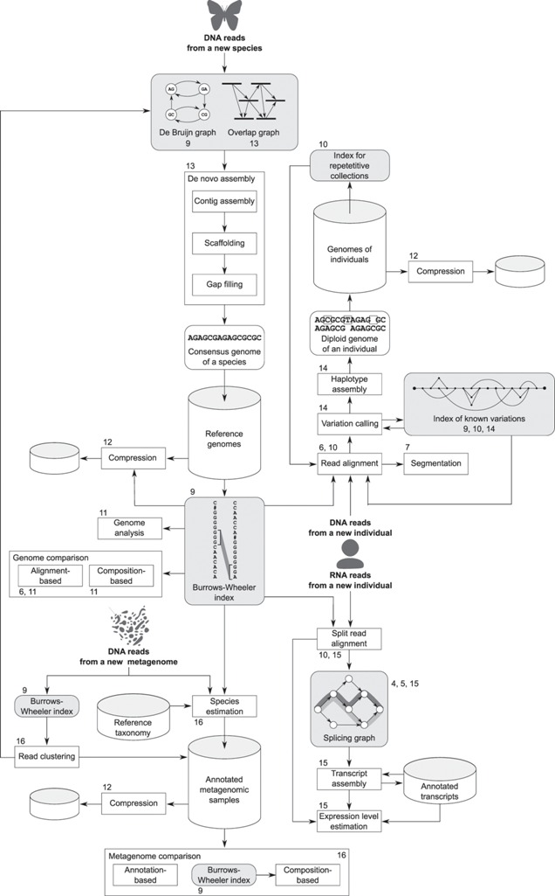
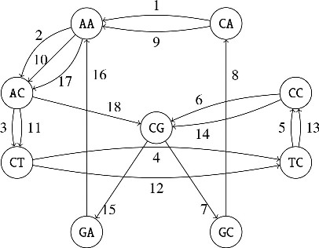
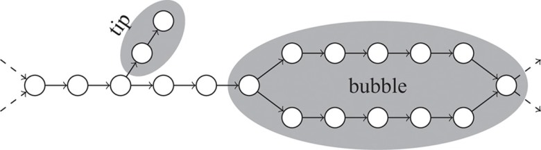
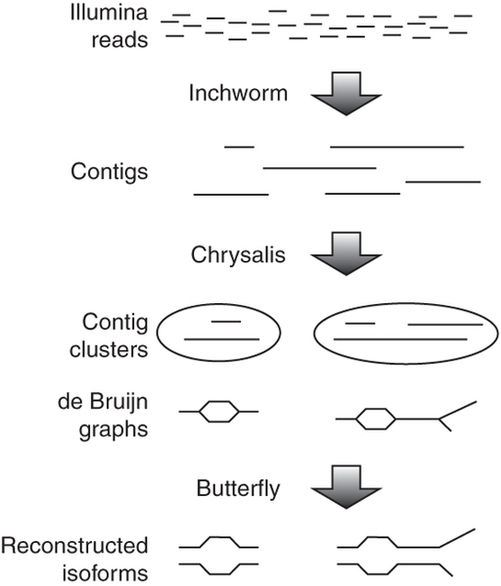
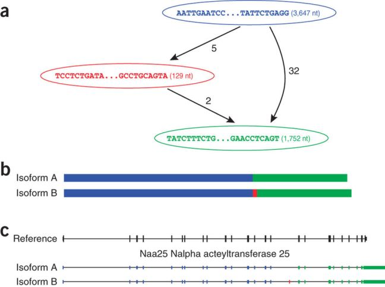
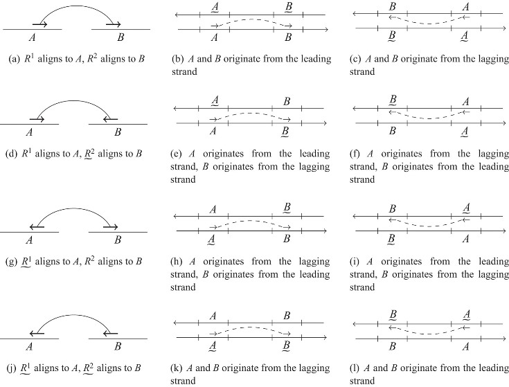
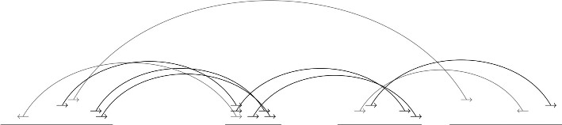
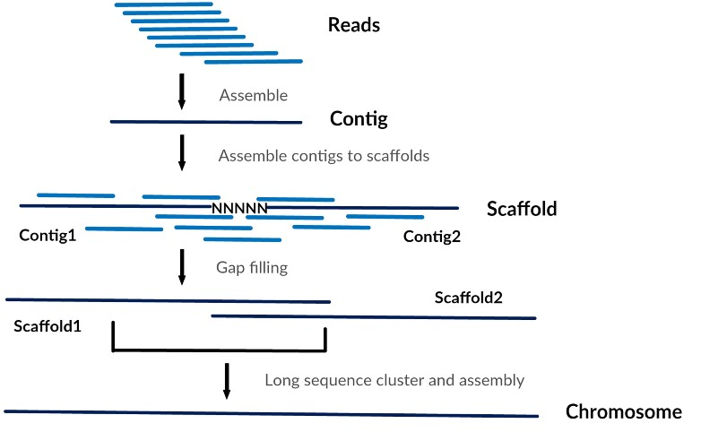

```{r knitr setup, include=FALSE,  eval=TRUE, echo=FALSE, warning=FALSE}
library(knitr)
knitr::opts_chunk$set(eval=TRUE, cache=FALSE, message=FALSE, warning=FALSE, 
                      comment = "", results="markup")
```

# Introduction

Both Sanger and high-throughput DNA sequencing produce sequences that usually are shorter than the original molecules being analyzed. This is also true for transcript sequencing. Therefore, in most cases, sequence fragments produced in sequencing experiments must be assembled into longer contiguous blocks, called contigs, and eventually into scaffolds and chromosomes. Assembled sequences can then be used to map reads, call variants and estimate expression levels in the case of transcripts.



Assembly usually comprises several steps, such as error correction, contig assembly, scaffolding, gap filling and validation. This process can be done *de novo* or instead assisted by a known reference genome. The recipes for successful assembly and annotation are under continuous evolution [@DominguezDelAngel2018].

# Read pre-processing error correction

Different sequencing platforms have different error rates and users must compensate for them.
The table summarizes the most popular platforms and their error rates [@Fox2014, @genohub]:

| Platform | Read type | Max read length | Most frequent error type	| Frequency |
| -------- | --------- | ----------- | ------------------------ | --------- |
| Capillary sequencing | SE | 1Kb | single nucleotide substitution (SNP)	| $10^{−1}$ |
| 454 GS | SE | 700b | Deletions	| $10^{−2}$ |
| PacBio Sequel	| SE | 20Kb | CG deletions | $10^{−2}$ |
| Ion Torrent PGM	| SE | 400b | Short deletions	| $10^{−2}$ |
| Solid	| PE | 100b | A-T bias | $2×10^{−2}$ |
| Illumina MiSeq | PE | 600b | SNP | $10^{−3}$ |
| Illumina HiSeq | PE | 300b | SNP | $10^{−3}$ |

For Illumina platforms, a popular approach is to compute $k$-mer spectra in order to correct errors [@Liu2013]. Most assemblies are currently performed by combining long reads (PacBio) with short Illumina reads, which are also used to correct for sequencing errors. In either case, users should inspect (and improve) the quality report of their reads with software such as [FASTQC](https://www.bioinformatics.babraham.ac.uk/projects/fastqc) and 
[Trimmomatic](http://www.usadellab.org/cms/?page=trimmomatic).


Sometimes it might be necessary to select a subset of reads and carry out the actual assembly with them, for instance when organellar genomes or plasmids of interest are to be assembled. This can be done by sequence similarity or by $k$-mer composition.

# Contig assembly

The goal of this stage is to build an assembly graph and find a set of paths such that the contiguous sequences produced are likely to be present in the genome under study [@Makinen2015].
With Sanger capillary sequencing computing overlaps was done by finding common superstrings. This was done considering the sequencing quality scores in order to compensate errors [@Dwyer2003].
As current sequence platforms produce large numbers of reads, these are pieced in $k$-mers which are then used to build a de Bruijn graph of ovelapping $k$-mers:



The process of finding optimal paths along de Bruijn graphs is greatly facilitated when haploid or homozygous genomes are sequenced.



However, there are cases were genomes just are heterozygous and more complex strategies are required. You can read more about this in our [blog](https://bioinfoperl.blogspot.com.es/2017/03/ensamblaje-genomas-plantas.html) (in Spanish).

In addition, assembly of transcripts requires a special way of handling bubbles, as these are most frequently simply isoforms of transcripts transcribed from the same gene.







# Scaffolding

This stage is concerned with finding the relative order and orientation of previously assembled contigs. This is done by mapping paired-end (PE) and mate-pair (MP) reads and selecting those aligning in different contigs.





# Gap filling

This step involves reconstructing the actual nucleotide sequence between scaffolded contigs. This is done by mapping reads that do not align completely to any of the contigs at each joint, as illustrated in the next figure.



# Annotation

The term annotation refers to the various tasks that lead to the precise definition, in terms of coordinates, of features encoded in the genome. It starts with repeat identification and the annotation of transposable elements (TE), and usually is followed by the annotation of protein-coding genes, tRNAs, rRNA or more specific features such as CRISPR loci [@DominguezDelAngel2018]. Genome annotation currently is always done with transcriptomics data, as expressed mRNA molecules help define gene models better than *de novo* predictors.

Regarding protein-coding genes, there are many public resources and databases that can be used to transfer functional annotations among proteins and protein domains, such as [UniProt](http://www.uniprot.org), [InterPro](https://www.ebi.ac.uk/interpro) or [Gene Ontology](http://www.geneontology.org). 

Users must be aware that sequencing errors might affect the annotation as indels might cause frame shifts, for instance. 

# Validation

Once a first assembly draft is produced it is necessary to performs tests to ascertain its accuracy. There are many possible approaches:

  + Computing assembly metrics such as [N50](https://en.wikipedia.org/wiki/N50,_L50,_and_related_statistics)

  + Mapping PE reads to the assembly. Visual inspection with software such as [IGV](http://software.broadinstitute.org/software/igv) or [Tablet](https://ics.hutton.ac.uk/tablet/) makes scaffolding errors easy to locate in places with poor mappings. Alternatively, the identification of assembly errors can be systematically done with unsupervised software tools [@Hunt2013].

  + Comparison to other related genomes / genetic maps.
  
  + Comparison of annotated genes and features to sequence databases. Software tools such as [BUSCO](http://busco.ezlab.org) check whether core genes found in related organisms are contained in the annotation.
  
  
.](pics/n50.png)


<!--    + FASTQ format
    + Pan-genomes
DUK, BWA mem, velvet, trinity, cp, barley

Pseudo
Algn, kmer kernel
fig 16.1
-->


# References